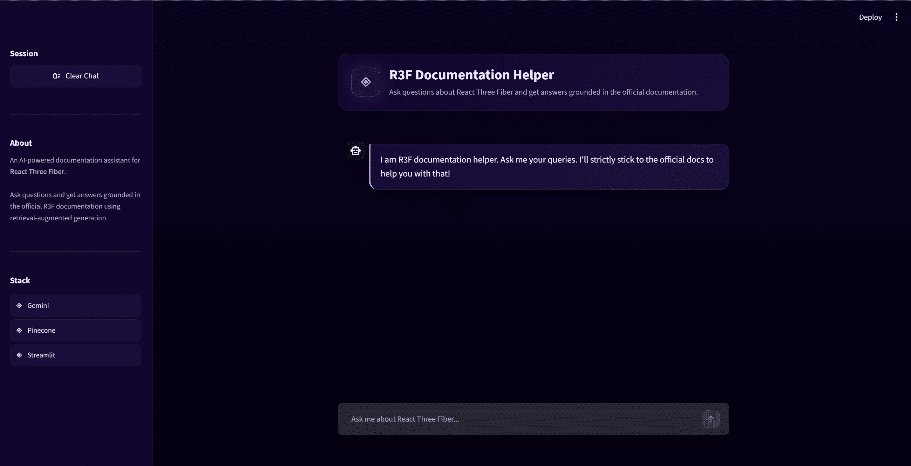
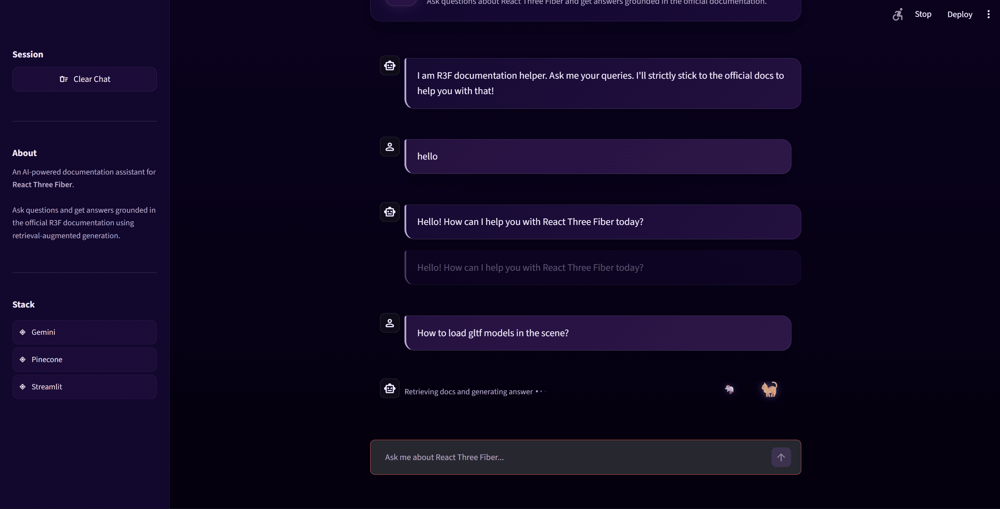
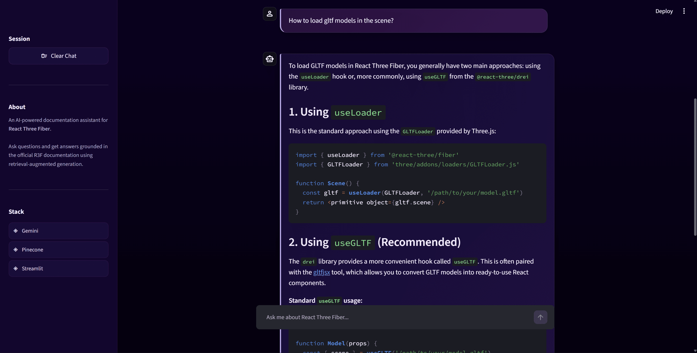
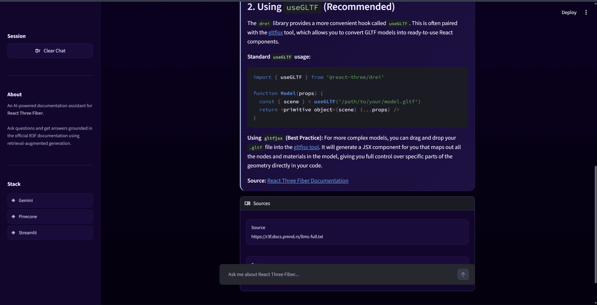
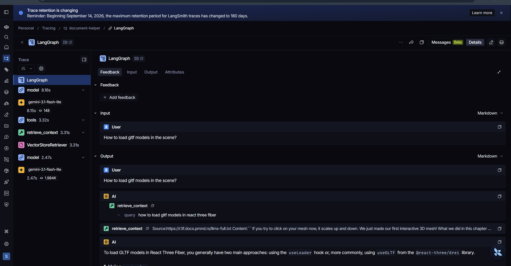

<div align="center">
  

  # R3F Document Helper Agent

  **A RAG-based agent for working with React Three Fiber documentation**

  
  
  
  
  

  [View Repository](https://github.com/Srijan-Petwal/R3F-Document-Helper-Agent) · [Demo Video](./document-helper-agent-R3F-demo%20(1).webm)
</div>

---

## Overview

Most LLMs answer R3F questions from memory — which drifts out of date. This agent instead **retrieves real R3F documentation from Pinecone** and reasons over it, using a **LangGraph agent** that calls retrieval as a *tool* rather than a fixed pipeline step.

```text
Documentation → Retrieval → Agent → Answer
```

> [!TIP]
> Retrieval here is **agentic, not mandatory** — the agent decides when it actually needs documentation, instead of always retrieving first.

## Screenshots

<p align="center">
  
</p>
<p align="center">
  
</p>
<p align="center">
  
</p>
<p align="center">
  
</p>

---

## Architecture

```text
        React Three Fiber Docs
                  │
                  ▼
           Tavily Crawl
                  │
                  ▼
        Document Processing
                  │
                  ▼
          Text Splitting
                  │
                  ▼
             Embeddings
                  │
                  ▼
             Pinecone
                  │
                  ▼
          ┌───────────────┐
          │   LangGraph   │
          │     Agent     │
          └───────┬───────┘
                  │
                  ▼
              Response
```

### Retrieval Flow

```text
User Question
      ↓
    Agent
      ↓
retrieve_context
      ↓
   Pinecone
      ↓
Relevant R3F Documentation
      ↓
    Agent
      ↓
   Answer
```

## Tech Stack

| Layer | Tools |
|---|---|
| **Agent / LLM** | Python · LangChain · LangGraph · OpenRouter · LangSmith |
| **RAG** | Tavily Crawl · Pinecone · LangChain Documents · RecursiveCharacterTextSplitter |
| **Dev** | uv · python-dotenv |

## Project Structure

```text
R3F-Document-Helper-Agent/
├── demo/                     # screenshots
├── src/document_helper_rag_based_agent/
│   ├── ingestion.py          # crawl, chunk, embed
│   ├── backend/core.py       # retrieval tool + agent
│   ├── ui.py                 # app interface
│   └── logger.py
├── pyproject.toml
└── uv.lock
```

---

## Getting Started

**Prerequisites:** Python 3.13+ · uv · Pinecone, OpenRouter, Tavily & LangSmith API keys

```bash
git clone https://github.com/Srijan-Petwal/R3F-Document-Helper-Agent.git
cd R3F-Document-Helper-Agent
uv sync
```

Activate the environment:
```bash
.venv\Scripts\activate      # Windows
source .venv/bin/activate   # macOS / Linux
```

Create a `.env` file:
```env
OPENROUTER_API_KEY=your_key
TAVILY_API_KEY=your_key
PINECONE_API_KEY=your_key
LANGSMITH_API_KEY=your_key
LANGSMITH_TRACING=true
LANGSMITH_PROJECT=R3F-Document-Helper-Agent
INDEX_NAME=<your_pinecone_index_name>
```

> [!IMPORTANT]
> Run the ingestion pipeline **first** to populate Pinecone before starting the app. Never commit your `.env` file.

---

## Why R3F?

R3F sits at the intersection of React and Three.js, with its own abstractions (`Canvas`, `useFrame`, `useThree`, Drei, loaders, materials, physics). That density of unfamiliar APIs made it a good domain to test whether real documentation improves an agent's answers.

> [!NOTE]
> This project uses **LangSmith** to trace every agent execution, tool call, and retrieval step — useful because for agentic systems, *what the agent actually did* matters almost as much as its final answer.

<p align="center">
  
  <br/>
  <sub>LangSmith trace for a GLTF-related query</sub>
</p>

## What I Learned

Crawling & chunking docs · embeddings & vector search · tool-based retrieval · LangGraph agent workflows · LangSmith tracing · debugging agent behavior · managing a project with `uv`.

The goal wasn't another chatbot — it was understanding what happens when an LLM gets real external knowledge, retrieval, and tools, and has to decide how to use them.

> [!CAUTION]
> This is an **experimental / learning project**, not a production-hardened tool. Expect rough edges.

## Roadmap

- [ ] Retrieval evaluation & reranking
- [ ] Hybrid retrieval
- [ ] Source attribution
- [ ] Conversation memory
- [ ] Streaming responses
- [ ] Documentation versioning
- [ ] Improved agent routing

---

<div align="center">

**[View on GitHub →](https://github.com/Srijan-Petwal/R3F-Document-Helper-Agent)**

</div>